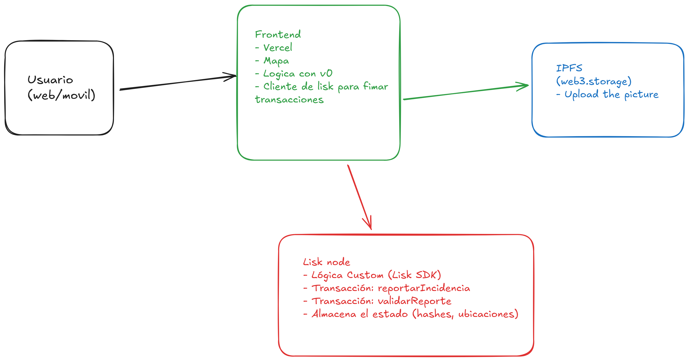

# Vigia
**A Censorship-Resistant Public Record for Civic Reporting**

*[Aleph Hackathon '25] [Lisk] [DePIN] [Public Good]*

🔴 **Live Demo**: https://vigia-aleph-hackathton.vercel.app/

🎬 **Video Pitch**: https://www.youtube.com/watch?v=pn6SkEJF4T0

---

## The Problem

In many Latin American cities, reporting infrastructure issues like potholes or broken streetlights is an opaque and frustrating process. Reports fall into a black box of bureaucracy, often being lost, ignored, or deleted without explanation. This lack of a permanent, transparent record creates deep citizen distrust and allows public infrastructure to decay, making accountability impossible.

## The Solution: Vigia

**Vigia** is a decentralized public good that empowers citizens by transforming civic reporting. We create a permanent, censorship-resistant, and community-verified public record of real-world infrastructure problems on the **Lisk L2 blockchain**.

By building a shared, verifiable source of truth, Vigia turns citizen reports from forgotten complaints into powerful, immutable data points that foster trust and drive real-world action.

---

## Key Features (Built during the Hackathon)

- **🌍 Decentralized Reporting**: Submit geolocated infrastructure issues with a photo and description.

- **🔒 Immutable Record**: Every report is a permanent transaction on the Lisk L2 blockchain, which cannot be deleted or altered.

- **📁 Decentralized Storage**: Report photos are uploaded to IPFS via Storacha/w3up, ensuring they are as censorship-resistant as the report itself.

- **✅ Community Validation**: A social trust layer where other users can validate reports, increasing their legitimacy and visibility.

- **🗺️ Dual View Interface**: Users can toggle between an interactive Map View and a scrollable Feed View to explore reports.

- **💰 Multi-Wallet Support**: Compatible with MetaMask, Rabbit, Coinbase Wallet, and Trust Wallet.

---

## How It Works (Architecture)

The architecture is designed to be simple and fully decentralized, removing central points of failure or control.



---

## Tech Stack

- **Blockchain**: Lisk L2 (EVM Compatible)
- **Smart Contracts**: Solidity
- **Development Framework**: Hardhat
- **Frontend**: Next.js, React, Tailwind CSS
- **UI Generation**: Vercel v0
- **Decentralized Storage**: IPFS / Storacha (via w3up-client)
- **Map**: OpenStreetMap with Leaflet.js
- **Wallet Interaction**: Ethers.js

---

## Getting Started (Local Setup)

### 1. Clone the repository:
```bash
git clone [YOUR_REPO_URL]
cd [YOUR_REPO_NAME]
```

### 2. Install all dependencies:
```bash
npm install
```

### 3. Environment Setup
Create a `.env.local` file in the root and add your configuration:

```bash
# Blockchain Configuration
PRIVATE_KEY="YOUR_METAMASK_PRIVATE_KEY"

# Web3.Storage / Storacha Configuration  
WEB3_STORAGE_EMAIL="YOUR_STORACHA_EMAIL"
WEB3_STORAGE_SPACE="YOUR_SPACE_DID"
WEB3_STORAGE_DID="YOUR_SPACE_DID"

# Network URLs
LISK_SEPOLIA_RPC_URL="https://rpc.sepolia-api.lisk.com"
HARDHAT_RPC_URL="http://127.0.0.1:8545"

# Deployed Contract Addresses
VIGIA_CONTRACT_ADDRESS_LISK_SEPOLIA="0x9aD20ACF1E3592efF473B510603f5f647994cE9b"
```

### 4. Compile the smart contract:
```bash
npx hardhat compile
```

### 5. Deploy the contract to Lisk Sepolia testnet:
```bash
npx hardhat ignition deploy ignition/modules/Vigia.ts --network liskSepolia
```

### 6. Run the development server:
```bash
npm run dev
```

Visit `http://localhost:3000` to see the application running.

---

## Smart Contract Details

- **Network**: Lisk Sepolia Testnet
- **Contract Address**: `0x9aD20ACF1E3592efF473B510603f5f647994cE9b`
- **Verified**: ✅ [View on Blockscout](https://sepolia-blockscout.lisk.com/address/0x9aD20ACF1E3592efF473B510603f5f647994cE9b)

### Key Functions:
- `crearReporte()` - Create a new infrastructure report
- `validarReporte()` - Validate an existing report  
- `getAllReports()` - Retrieve all reports
- `getReportesPorCreador()` - Get reports by creator address

---

## IPFS Integration

Reports use **Storacha (Web3.Storage)** for decentralized image storage:
- **Gateway**: `https://{CID}.ipfs.w3s.link`
- **Permanent Storage**: Images cannot be deleted or censored
- **Global Access**: Available worldwide through IPFS network

---

## Multi-Wallet Support

Vigia supports multiple wallet providers:
- 🦊 **MetaMask** 
- 🐰 **Rabbit Wallet**
- 🏪 **Coinbase Wallet**
- 🔐 **Trust Wallet**

The application automatically detects available wallets and allows users to choose their preferred option.

---

## Deployment

### Frontend (Vercel)
```bash
npm run build
# Deploy to Vercel
```

### Smart Contracts (Lisk Sepolia)
```bash
npx hardhat ignition deploy ignition/modules/Vigia.ts --network liskSepolia
```

---

## Hackathon Submission Tracks

This project has been submitted primarily for the following tracks:

**Primary**: Lisk (RWA/DePIN), Crecimiento & ENS (Public Good)

**Secondary**: Base (for the Mini-App like user experience), AI & v0 (for the development process).

---

## Future Roadmap

- 🏛️ **Government Integration**: API for municipal governments to access verified reports
- 📊 **Analytics Dashboard**: Data visualization for infrastructure trends
- 🏆 **Incentive System**: Token rewards for quality reporting and validation
- 🌐 **Multi-City Expansion**: Deploy to multiple Latin American cities
- 📱 **Mobile App**: Native iOS/Android applications

---

## Contributing

We welcome contributions! Please:

1. Fork the repository
2. Create a feature branch
3. Make your changes
4. Submit a pull request

---

## License

This project is licensed under the MIT License - see the [LICENSE](LICENSE) file for details.

---

## Team

Built with ❤️ during Aleph Hackathon 2025

**Contact**: [YOUR_EMAIL]
**GitHub**: [YOUR_GITHUB]
**Twitter**: [YOUR_TWITTER]

---

*"Empowering citizens through decentralized civic reporting"*

## Project Overview

This example project includes:

- A simple Hardhat configuration file.
- Foundry-compatible Solidity unit tests.
- TypeScript integration tests using [`node:test`](nodejs.org/api/test.html), the new Node.js native test runner, and [`viem`](https://viem.sh/).
- Examples demonstrating how to connect to different types of networks, including locally simulating OP mainnet.

## Usage

### Running Tests

To run all the tests in the project, execute the following command:

```shell
npx hardhat test
```

You can also selectively run the Solidity or `node:test` tests:

```shell
npx hardhat test solidity
npx hardhat test nodejs
```

### Make a deployment to Sepolia

This project includes an example Ignition module to deploy the contract. You can deploy this module to a locally simulated chain or to Sepolia.

To run the deployment to a local chain:

```shell
npx hardhat ignition deploy ignition/modules/Counter.ts
```

To run the deployment to Sepolia, you need an account with funds to send the transaction. The provided Hardhat configuration includes a Configuration Variable called `SEPOLIA_PRIVATE_KEY`, which you can use to set the private key of the account you want to use.

You can set the `SEPOLIA_PRIVATE_KEY` variable using the `hardhat-keystore` plugin or by setting it as an environment variable.

To set the `SEPOLIA_PRIVATE_KEY` config variable using `hardhat-keystore`:

```shell
npx hardhat keystore set SEPOLIA_PRIVATE_KEY
```

After setting the variable, you can run the deployment with the Sepolia network:

```shell
npx hardhat ignition deploy --network sepolia ignition/modules/Counter.ts
```
